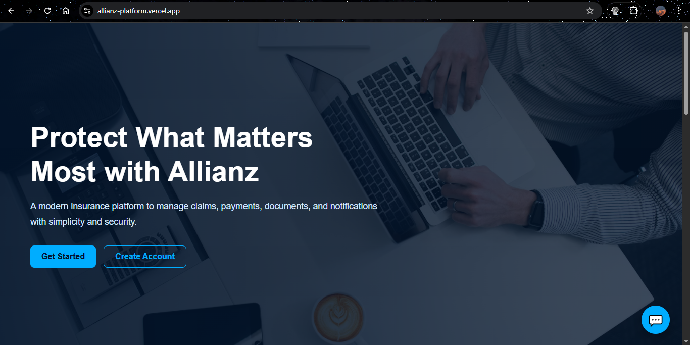
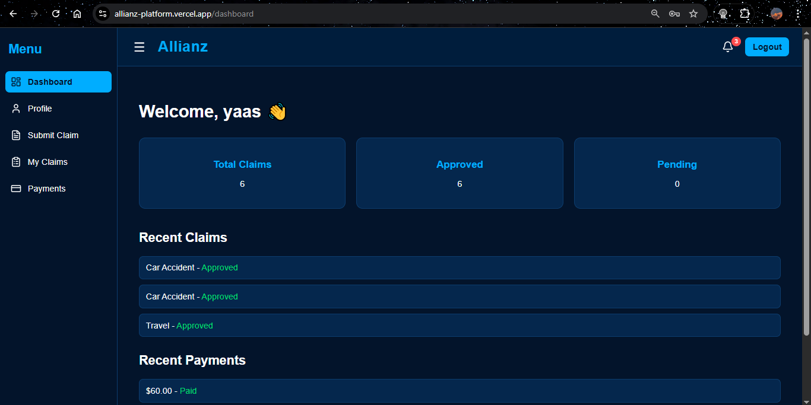
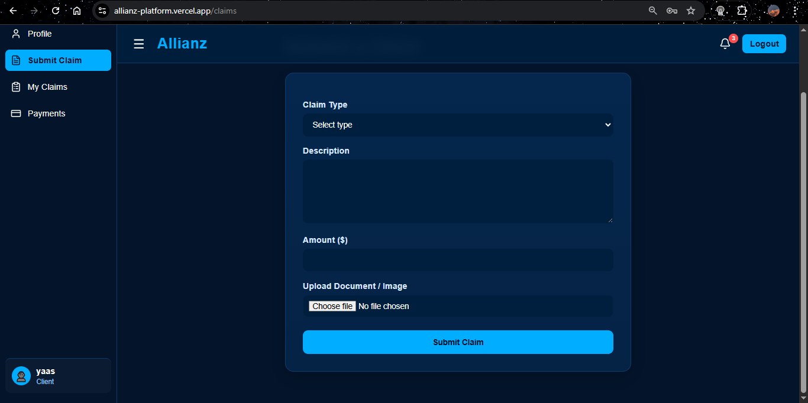
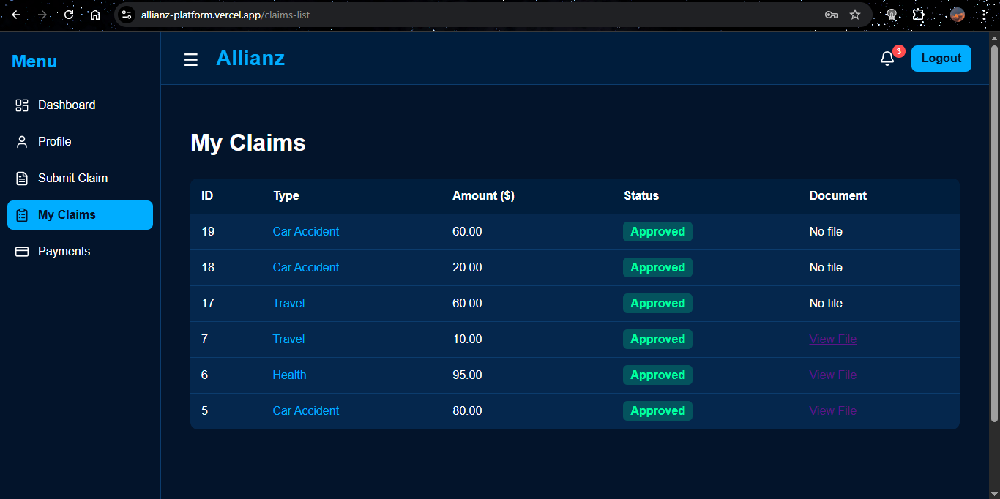
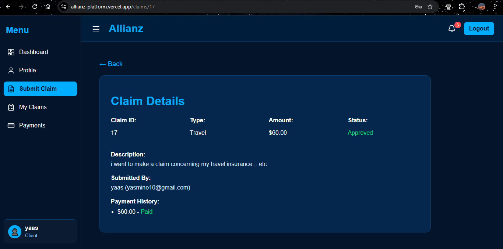
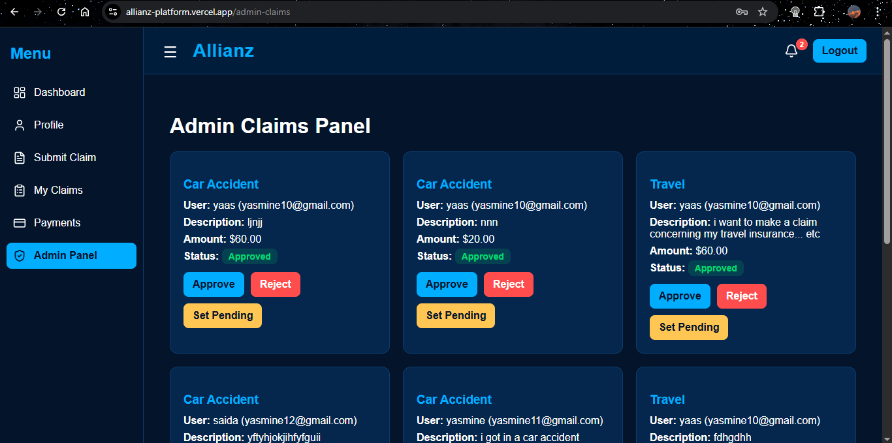
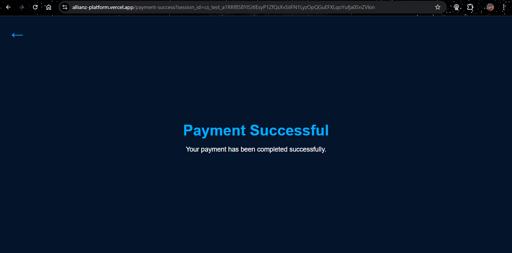
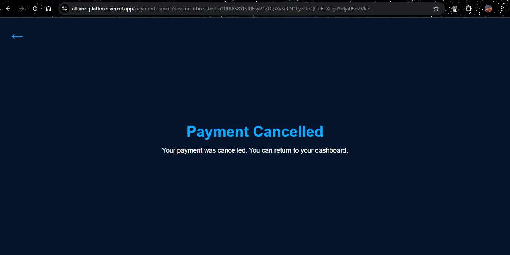

# Allianz Insurance Platform

<p align="center">
  <b>Full-stack insurance claim management web application</b><br>
  Built as an internship project using <b>React</b>, <b>Laravel</b>, <b>Stripe</b>, <b>Vercel</b>, and <b>Render</b>.
</p>

<p align="center">
  
  
  
  
  
</p>

## Overview

The **Allianz Insurance Platform** is a web application designed to simplify the management of insurance claims. It provides a dedicated space for **clients** to submit claims, upload supporting documents, track claim status, and pay approved claims online. It also provides an **admin interface** for reviewing submitted claims, updating their status, and monitoring payment activity.

This project was developed as part of an **internship project**, with the objective of applying full-stack web development concepts in a practical business-oriented system.

## Live Demo

- **Frontend:** https://allianz-platform.vercel.app/

## Features

### Client Features
- User registration and login
- Personal dashboard
- Claim submission form
- File upload support for claim documents
- Claim list and claim details pages
- Document preview/opening from submitted claims
- Online payment for approved claims through Stripe Checkout
- Payment success and cancellation pages
- Notifications related to claims and payments
- Profile page

### Admin Features
- Admin login
- View all submitted claims
- View claim details and uploaded documents
- Change claim status to **Approved**, **Rejected**, or **Pending**
- Track related payment information
- Receive notifications on user activity

## Tech Stack

### Frontend
- React
- React Router
- Vite
- CSS

### Backend
- Laravel
- Eloquent ORM
- Laravel Storage
- REST API
- Stripe PHP SDK

### Deployment
- **Vercel** for the frontend
- **Render** for the backend

## Project Structure

```text
project-root/
├── frontend/   # React application
└── backend/    # Laravel API
```

## Application Workflow

1. A client registers or logs in.
2. The client submits an insurance claim and may upload a supporting file.
3. The claim is stored in the backend and visible to the admin.
4. The admin reviews the claim and updates its status.
5. If the claim is approved, the client can proceed to payment using Stripe Checkout.
6. After payment, the client is redirected to a success or cancellation page.
7. Notifications are generated for both client and admin actions.


## Screenshots











## Installation and Setup

### Prerequisites

Make sure you have these installed:
- Node.js and npm
- PHP
- Composer
- MySQL
- Git

## Clone the Repository

```bash
git clone https://github.com/Yaasmiiine/allianz-platform.git
cd allianz-platform
```

## Frontend Setup

```bash
cd frontend
npm install
npm run dev
```

### Frontend Environment Variables

Create a `.env` file inside `frontend/` and add the variables used by your frontend configuration.

```env
VITE_API_URL=http://127.0.0.1:8000/api
VITE_BASE_URL=http://127.0.0.1:8000
```

> Update the variable names if your `config.js` file uses different names.

## Backend Setup

```bash
cd backend
composer install
cp .env.example .env
php artisan key:generate
php artisan migrate
php artisan storage:link
php artisan serve
```

### Backend Environment Variables

Update `backend/.env` with values similar to the following:

```env
APP_NAME="Allianz Platform"
APP_ENV=local
APP_KEY=
APP_DEBUG=true
APP_URL=http://127.0.0.1:8000

FRONTEND_URL=http://localhost:5173
FILESYSTEM_DISK=public

DB_CONNECTION=mysql
DB_HOST=127.0.0.1
DB_PORT=3306
DB_DATABASE=your_database_name
DB_USERNAME=your_database_user
DB_PASSWORD=your_database_password

STRIPE_KEY=your_stripe_publishable_key
STRIPE_SECRET=your_stripe_secret_key
```

## Stripe Payment Integration

- Only **approved claims** can be paid.
- Stripe Checkout redirects users back to the frontend using:
  - `/payment-success`
  - `/payment-cancel`
- The success page sends the Stripe `session_id` to the backend to confirm payment status.

## File Uploads

Claim documents are stored using Laravel's **public disk**.

### Supported File Types
- PDF
- JPG
- JPEG
- PNG

### Maximum File Size
- 10 MB

### Required Command

```bash
php artisan storage:link
```

## Deployment

### Frontend Deployment on Vercel

Because the frontend uses React Router, a `vercel.json` file is needed for SPA route handling.

```json
{
  "rewrites": [
    {
      "source": "/(.*)",
      "destination": "/index.html"
    }
  ]
}
```

## Known Limitation

When deployed on **Render free plan**, uploaded files may not persist after redeploys or restarts because the filesystem is **ephemeral**. For a more production-ready deployment, use:
- a persistent disk on a supported plan, or
- cloud storage such as **AWS S3** or **Cloudinary**

## Testing Checklist

### Client Side
- Register a new account
- Log in successfully
- Submit a claim with and without a file
- Open uploaded claim documents
- View claim details
- Pay an approved claim
- Verify payment success and cancellation pages
- Check notifications

### Admin Side
- Log in as admin
- View all claims
- Open uploaded claim files
- Approve, reject, and reset claim status
- Verify notifications and payment tracking

### Deployment Checks
- Refresh protected pages such as `/dashboard`
- Refresh detail pages such as `/claims/:id`
- Refresh `/payment-success`
- Verify direct opening of uploaded files

## Future Improvements

- Email notifications
- Search and filtering for claims
- Dashboard statistics and analytics
- Better validation and exception handling
- Cloud file storage integration
- Automated testing with Playwright or PHPUnit
- Improved UI/UX and responsiveness

## Educational Value

This project demonstrates practical use of:
- role-based authentication
- RESTful API design
- frontend/backend integration
- file uploads and storage handling
- payment workflow integration with Stripe
- deployment of a full-stack application

## Author

Developed by Yasmine as part of an internship project in web development at Allianz Assurance.